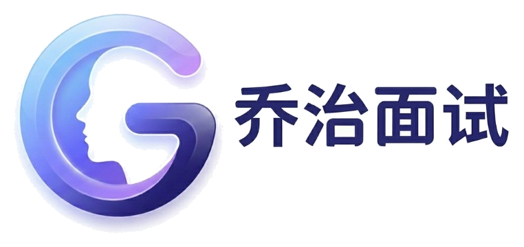

# George Interview · 乔治面试

<p align="center">
  
</p>

<p align="center">
  <a href="./LICENSE"></a>
  
</p>

**George Interview** is an **AI digital-human interview** system for hiring and practice: job context, resume-aware flow, multi-turn Q&amp;A, and WebRTC streaming. Entry point: `/interview.html`.

---

## Requirements

- **Ubuntu 24.04** (recommended), **Python 3.10**, **CUDA**-matched **PyTorch**  
- **NVIDIA GPU** (e.g. 3060+ for wav2lip; musetalk needs stronger GPUs)  
- **TCP** listen port and **UDP** for WebRTC (or TURN/SRS as needed)

---

## Quick start

```bash
conda create -n nerfstream python=3.10
conda activate nerfstream
# Install PyTorch for your CUDA version, then:
pip install -r requirements.txt

cp .env.example .env
# Edit .env: LLM keys, JWT_SECRET, TTS, etc.

# Download wav2lip (or other) weights into models/ and avatar packs into data/avatars/
# Match AVATAR_ID in .env to the avatar folder name.

bash start.sh
# Open http://<host>:<port>/interview.html
```

If Hugging Face is slow:

```bash
export HF_ENDPOINT=https://hf-mirror.com
```

---

## Not in Git

`.env`, `models/`, `data/` (including local DB), video blobs, and TLS private keys are ignored. See `.gitignore` and `ssl/README.md`.

---

## License

**Apache License 2.0** — see `LICENSE`.

---

## Brand assets

- `assets/brand-logo-horizontal.png`  

[中文版 README](./README.md)
